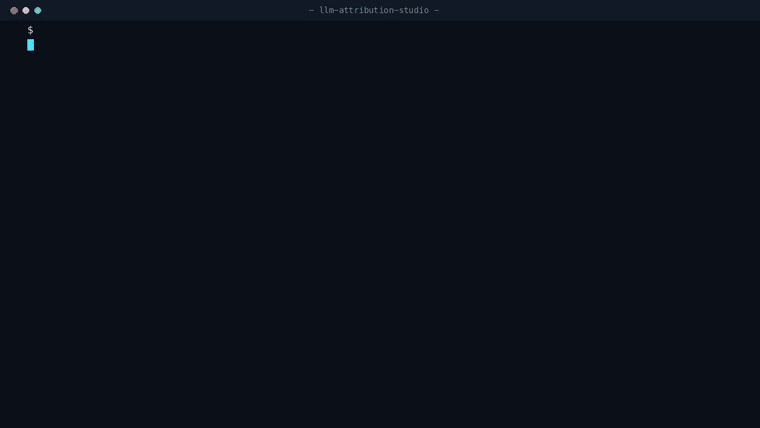

# 🔬 LLM Attribution Studio

[](https://github.com/shashwatsaxena571/llm-attribution-studio/actions/workflows/tests.yml)

<p align="center">
  
</p>

**Why did the model produce *that* output? Token-level attribution you can actually read.**

## The problem

LLMs are black boxes, and the usual answer — "look at the attention weights" — does not hold up. Jain & Wallace showed attention is not explanation: you can find very different attention distributions that produce identical predictions. Chain-of-thought has the same issue — it reads like reasoning, but studies have measured accuracy shifts of up to 36% driven by biasing features the CoT never mentions.

What we actually need is an attribution that is **causal by construction**: remove a token, and measure what the output does.

## The approach

```
[Prompt] → [Tokenizer] → [Occlusion loop] → [Attribution scores] → [Heatmap]
```

**Occlusion attribution** — mask each input token in turn and measure the change in the model's score:

- Positive delta → that token *supported* the output
- Negative delta → that token *opposed* it

It is model-agnostic, needs no gradients, and — unlike attention — it is an intervention, not a correlation.

The scoring function is a single injectable callable:

```python
attributor = OcclusionAttributor(score_fn)   # score_fn: list[str] -> float
result = attributor.attribute(tokens)
print(OcclusionAttributor.render_terminal(result))   # ANSI heatmap
```

Phase 1 ships with a lexicon scorer so the demo runs anywhere in under a second. Swapping in `log P(target_token)` from GPT-2 or Llama changes **one function** — the interface stays identical.

## Quick start

```bash
pip install -r requirements.txt
python demo.py
python -m pytest tests/ -v
```

`demo.py` attributes every token of *"I love this phone but the software is buggy and slow"* and renders a green/red terminal heatmap: `love` supports the positive sentiment, `buggy` and `slow` pull against it.

## Roadmap

- [x] Phase 1 — occlusion core + terminal heatmap + tests
- [ ] Phase 2 — HuggingFace transformers integration (GPT-2 first: small, fast, reproducible)
- [ ] Phase 3 — attention rollout & gradient×input, side-by-side comparison view (do the methods agree?)
- [ ] Phase 4 — Streamlit dashboard with contrastive view: "why X and not Y?"

Phase 3 is the interesting one for research: the XAI disagreement problem is well documented — 84% of practitioners hit contradictory explanations from different methods, with rank agreement as low as 0.19. Putting occlusion, attention, and gradients side by side on the same tokens makes that disagreement visible instead of hidden.

## Part of a bigger stack

- ⚙️ [explainops](https://github.com/shashwatsaxena571/explainops) — generate & version explanations as pipeline artifacts
- 📉 [explanation-drift-monitor](https://github.com/shashwatsaxena571/explanation-drift-monitor) — detect when explanations shift
- 🔍 [lineage-explanation-tracer](https://github.com/shashwatsaxena571/lineage-explanation-tracer) — trace the shift to the corrupt upstream table
- 🔬 **llm-attribution-studio** *(this repo)* — the same question, one level down: which *tokens* drove the output

I'm a **Data Engineer at IBM** and a **PhD scholar in Trustworthy & Explainable AI**. 📰 Weekly newsletter: [**Explainable Pipelines**](https://www.linkedin.com/newsletters/7488207829871304704/) · 💼 [LinkedIn](https://www.linkedin.com/in/saxena-shashwat/)

## License

MIT
